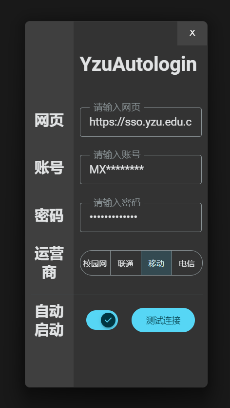

# YZUAutoLogin 扬州大学校园网自动登录

本人非计科专业，制作这软件也仅为大概学习前后端联系，未系统接触过 go、js 教学（ AI含量极高 ），固代码逻辑可能存在很大问题，问题处理也并不健全，多请见谅🙏欢迎各位大佬协助开发解决现存问题。

## 简介

`go 后端` 加 `网页前端` `wails框架` 构建的带有 ui 的校园网自动登录应用

**原理：**

- `go - rod` 模拟网页操作点击输入账号密码登录
- 用户数据存储于同路径 `data.json` 文件
- 打开 `开机自启动` 后启动软件会自动执行登录校园网

**结构**

- `systry` 构建系统托盘
- 前端 ui 组件引用 `sober` 库

## 已知的问题

重复隐藏、显示应用会导致系统托盘卡住，无法打开菜单

开机自启动设置方式为在注册表中添加启动项，有可能会被 `windowsdefender` 阻止导致程序崩溃。

理论上兼容 mac 但没有mac平台，暂时难以测试，有兴趣欢迎一起开发修改问题🙏

## 应用截图

